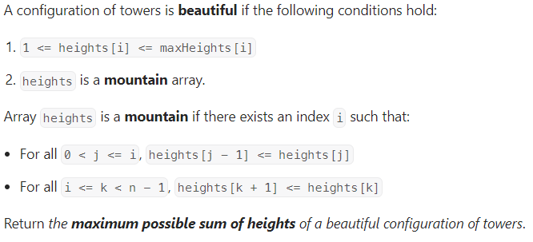

# [2865. Beautiful Towers I](https://leetcode.com/problems/beautiful-towers-i/description/)

## The Q is : you have been given with the maxHeights of the towers which you can setup at the ith index. Now you have to setup towers at each ith index and make a ```heights[]```, such that the full configuration of towers looks beautiful.

## TestCases :-


## Intuition :-

### See TC 1 : Here we selected one peak ele i.e., 9(at index 3) and then we went left side to setup the tower, as we know while going left side from 9 we should be in decreasing or equal to order so we kept on going all to the left side and maintained the ```maxtill : which says maximum till now```. and did same thing on rightside of 9.
- when I went to ```index 2``` then ```maxtill = 9```, and I setup the tower of ```height = Math.min(maxtill, maxHeight[2])``` and updated my ```maxtill = 3```. 
    - at index 2 maxtill value signifies that I can setup tower of ```height <= 9``` **to maintain the mountain configuration** but ```maxHeight[2]``` did'nt allow me
    - updated my ```maxtill = 3``` bcz when I will go to index 1 to setup my tower then maxtill value will signifies that I can setup tower of ```height <= 3``` **to maintain the mountain configuration**
    - so maxtill and maxHeight[] for every index is a type of restriction which they are giving to setup the tower that's why we are selecting minimum where they both agree.
### As u saw in other tcs that there is no pattern to find peak element of the mountain array so we are trying to make every index as peakElement and finding sum based on that peak ele.

```java
class Solution {
    public long maximumSumOfHeights(List<Integer> maxHeights) {
        int n = maxHeights.size();

        long ans = 0;
        for(int i = 0; i<n; i++){
             long sum = maxHeights.get(i);
             int maxtill = maxHeights.get(i);
            for(int j = i-1; j>=0; j--){
                sum+= Math.min(maxtill, maxHeights.get(j));
                maxtill = Math.min(maxtill, maxHeights.get(j));
            }
            maxtill = maxHeights.get(i);
            for(int j = i+1; j<n; j++){
                sum+=Math.min(maxtill, maxHeights.get(j));
                maxtill = Math.min(maxtill, maxHeights.get(j));
            }

            ans = Math.max(ans,sum);
        }

        return ans;
    }
}
```